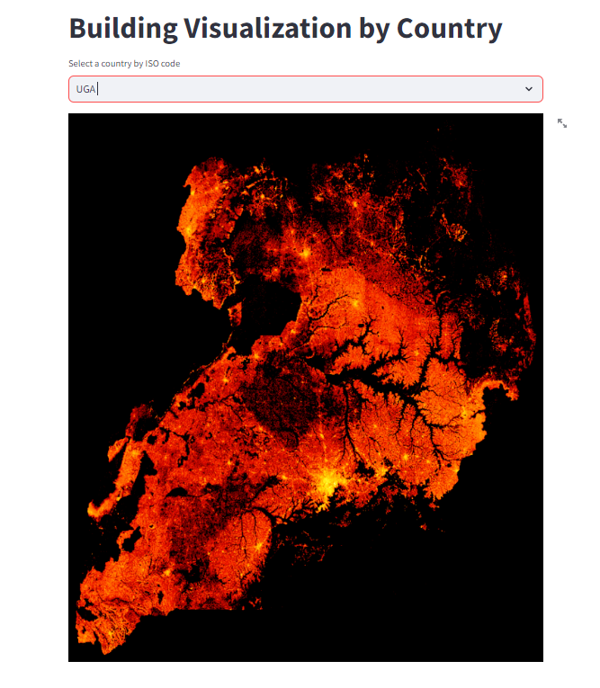

# Population Density Maps 
[This Gradioo Python](https://pop-density-maps.streamlit.app/) application transforms the Colab Notebook developed by Steven Kent into an interactive tool for exploring housing density by country. Users can enter a 3-letter country code from a provided list, and the application will generate a housing density map for the selected country.

## DEMO
Click the example generated image for Uganda below to view the app demo.

## [](https://www.loom.com/share/4917be6878b5402393d43d99d91bf105?sid=d6adaceb-67eb-4a28-a84e-4e44fbfbc312)

## How to clone and run this app on your machine

#### Step 1. Clone this repo
```python
git clone https://github.com/LNshuti/pop-density-maps.git
```
#### Step 2: Create an isolated environment to manage dependencies
```python
cd pop-density-maps
conda env create --file=environment.yaml
```
#### Step 3: Install the required python packages
```python
pip install -r requirements.txt 
```
#### Step 5: Run Python Application
```python 
python run app.py
```

## How to deploy the app with Docker
#### Build the docker image
```python
docker build -t pop-density .
```
#### Run the application
```python
docker run --rm -p 8501:8501 --name pop-density-container pop-density 
```
#### Navigate to the application by typing the following in a web browser
```python
http://localhost:8501/
```

## References 
1. **Stephen Kent**. Egypt Buildings. A Google Colab Notebook for Querying S3 Data and build a Map using Python and SQL. https://github.com/kentstephen/egypt_buildings
